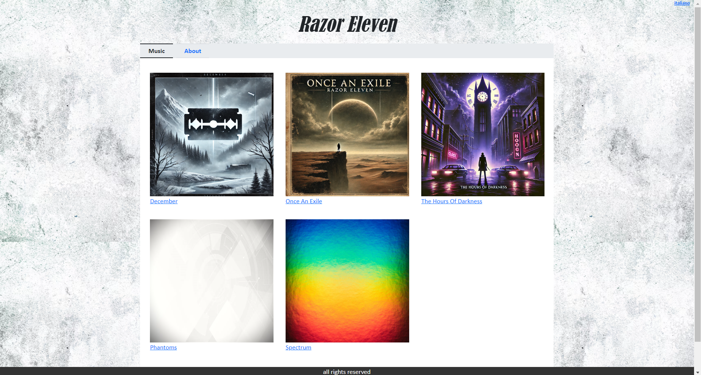
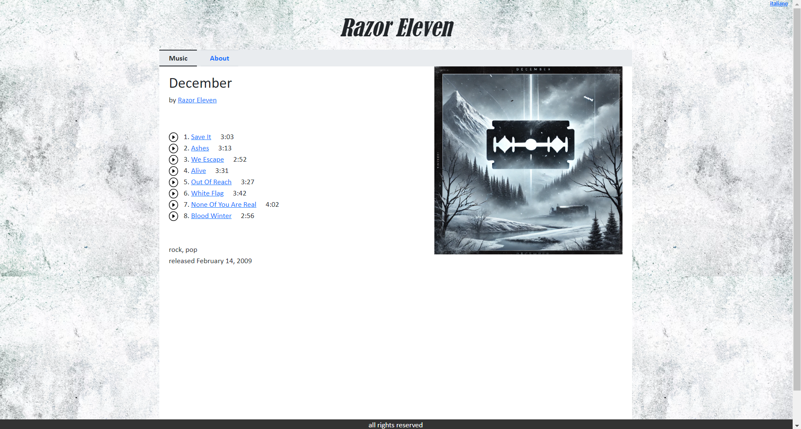
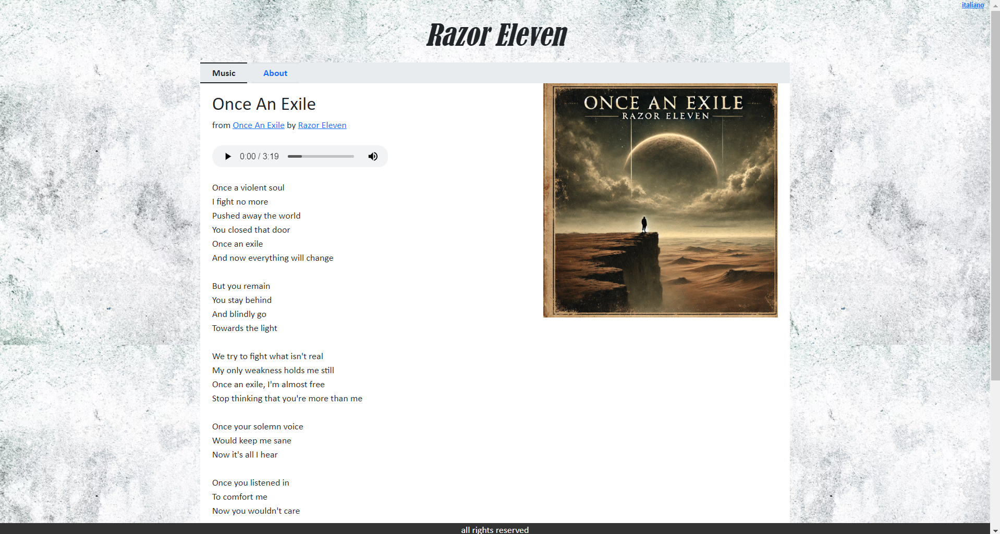

# MyMusic

MyMusic is a simple web application I developed in 2023 to learn and explore the Spring Framework and Thymeleaf. 
Inspired by Bandcamp, the application serves as a platform for a musician to showcase their discography, 
where users can explore albums, listen to tracks, and view song lyrics.  

The musician **Razor Eleven** used for developing this application is fictional. 
The tracks available for listening are from  **Razor Red Noise** (https://razorrednoise.bandcamp.com), 
a solo electronic rock project founded in 2008 by Alex McMillan. All rights for the songs go to him.  

  

  

